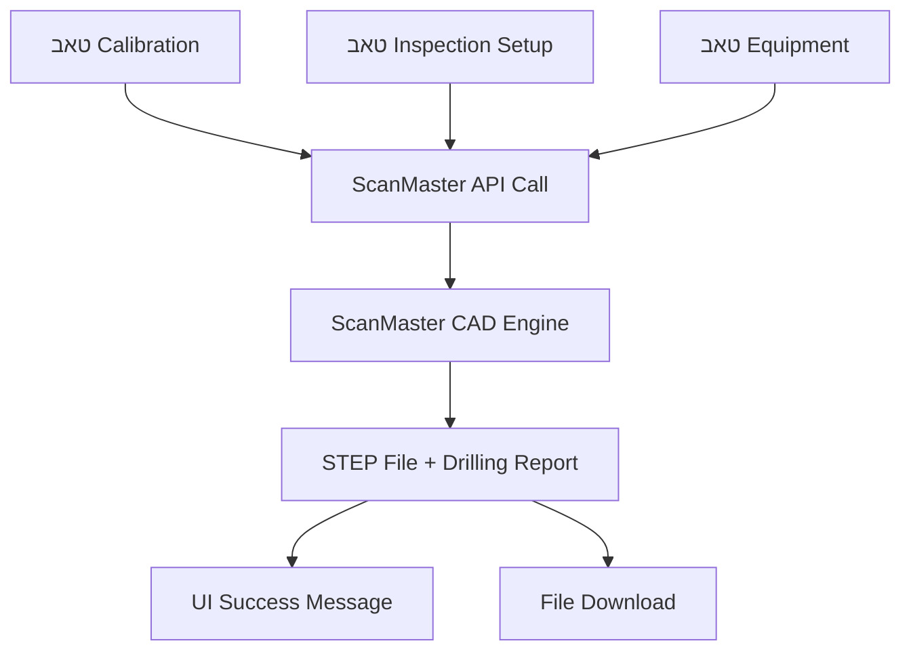

# 📋 מסמך דרישות טכניות - אינטגרציית ScanMaster CAD Engine עם מערכת הכיול

## 🎯 מטרת המסמך

מסמך זה מפרט את הדרישות הטכניות לאינטגרציה של **ScanMaster CAD Engine v3.0** עם מערכת הכיול הקיימת. המנוע מספק יכולת יצירת בלוקי כיול מקצועיים עם קידוח חורי FBH (Flat Bottom Holes) אוטומטי לפי תקנים בינלאומיים.

---

## 🏗️ ארכיטקטורת האינטגרציה



---

## 📊 מבנה הנתונים הנדרש

### 1. **פורמט קריאת API**

**Endpoint:** `POST /api/cad/engine/parts`

**Request Body:**

```typescript
interface ScanMasterCADRequest {
  shapeType: "calibration_block" | "flat_block" | "fbh_block" | "test_block";
  parameters: {
    length: number;    // אורך בלוק במ"מ
    width: number;     // רוחב בלוק במ"מ  
    height: number;    // גובה בלוק במ"מ
  };
  calibrationData: {
    // נתונים מטאב Calibration
    fbhSizes?: string;           // "3/64, 1/8, 1/4" או "auto" לבחירה חכמה
    metalTravelDistance?: number; // מרחק נסיעה במתכת (מ"מ)
    blockDimensions?: {          // מימדי בלוק
      L: number;
      W: number; 
      H: number;
    };
    standardType?: string;       // "MIL-STD-2154" | "ASTM-A388" | "ASME-V"
    
    // נתונים מטאב Inspection Setup
    material?: string;           // "aluminum" | "steel" | "stainless_steel" | "titanium"
    partThickness?: number;      // עובי החלק במ"מ
    partType?: string;           // סוג החלק
    isHollow?: boolean;          // האם החלק חלול
    acceptanceClass?: string;    // "AAA" | "AA" | "A" | "B" | "C"
    
    // נתונים מטאב Equipment
    probeType?: string;          // "contact" | "ultrasonic" | "immersion"
    frequency?: number;          // תדירות ב-MHz
    inspectionType?: string;     // "straight_beam" | "angle_beam"
  };
  metadata?: {
    userId?: string;
    projectId?: string;
    partName?: string;
  };
}
```

### 2. **פורמט התגובה**
```typescript
interface ScanMasterCADResponse {
  success: boolean;
  outputPath: string;          // נתיב לקובץ STEP
  executionTime: number;       // זמן ביצוע בשניות
  message: string;
  partInfo: {
    originalShapeType: string;
    cadEngineType: string;
    hasDrilledHoles: boolean;
    holesCount: number;
    fileSize: number;          // גודל קובץ בבייטים
    
    // דוח קידוח מפורט
    drillingReport?: {
      totalHoles: number;
      drillingMethod: string;
      standardsCompliance: string;
      confidenceScore: number; // 0.0-1.0
      
      holeDetails: Array<{
        idNum: string;         // "2154/3/0100"
        diameter: number;      // קוטר במ"מ
        depth: number;         // עומק במ"מ
        position: {
          x: number;
          y: number;
          z: number;
        };
        tolerance: string;     // "±0.05mm"
        note: string;          // תיאור FBH
      }>;
      
      drillingStatistics: {
        uniqueDiameters: number;
        averageDepth: number;
        totalVolume: number;   // נפח כולל של החורים
      };
    };
  };
}
```

---

## 🔧 דרישות פיתוח - צד Frontend

### 1. **שדות הטפסים הנדרשים**

#### טאב Calibration:
```typescript
interface CalibrationTabFields {
  fbhSizes: string;           // Input text - "3/64, 1/8, 1/4" או dropdown
  metalTravelDistance: number; // Input number במ"מ
  blockDimensions: {          // 3 inputs נפרדים
    L: number;                // Length
    W: number;                // Width  
    H: number;                // Height
  };
  standardType: string;       // Select dropdown
}
```

#### טאב Inspection Setup:
```typescript
interface InspectionSetupTabFields {
  material: string;           // Select: aluminum/steel/stainless_steel/titanium
  partThickness: number;      // Input number במ"מ
  partType: string;           // Input text או select
  isHollow: boolean;          // Checkbox
  acceptanceClass: string;    // Select: AAA/AA/A/B/C
}
```

#### טאב Equipment:
```typescript
interface EquipmentTabFields {
  probeType: string;          // Select: contact/ultrasonic/immersion
  frequency: number;          // Input number ב-MHz
  inspectionType: string;     // Radio buttons: straight_beam/angle_beam
}
```

### 2. **קומפוננטת אינטגרציה**

צור קומפוננטה חדשה `CalibrationCADIntegration.tsx`:

```tsx
import React, { useState } from 'react';

interface CalibrationCADIntegrationProps {
  // נתונים מהטאבים שלך
  calibrationData: CalibrationTabFields;
  inspectionData: InspectionSetupTabFields;
  equipmentData: EquipmentTabFields;
  
  // מטאדטה
  userId?: string;
  projectId?: string;
  
  // Callbacks
  onSuccess?: (result: ScanMasterCADResponse) => void;
  onError?: (error: string) => void;
}

export const CalibrationCADIntegration: React.FC<CalibrationCADIntegrationProps> = ({
  calibrationData,
  inspectionData,
  equipmentData,
  userId,
  projectId,
  onSuccess,
  onError
}) => {
  const [isGenerating, setIsGenerating] = useState(false);
  
  const handleGenerateCAD = async () => {
    setIsGenerating(true);
    
    try {
      const requestData = {
        shapeType: "calibration_block",
        parameters: {
          length: calibrationData.blockDimensions.L,
          width: calibrationData.blockDimensions.W,
          height: calibrationData.blockDimensions.H,
        },
        calibrationData: {
          // מטאב Calibration
          fbhSizes: calibrationData.fbhSizes,
          metalTravelDistance: calibrationData.metalTravelDistance,
          blockDimensions: calibrationData.blockDimensions,
          standardType: calibrationData.standardType,
          
          // מטאב Inspection
          material: inspectionData.material,
          partThickness: inspectionData.partThickness,
          partType: inspectionData.partType,
          isHollow: inspectionData.isHollow,
          acceptanceClass: inspectionData.acceptanceClass,
          
          // מטאב Equipment
          probeType: equipmentData.probeType,
          frequency: equipmentData.frequency,
          inspectionType: equipmentData.inspectionType,
        },
        metadata: {
          userId,
          projectId,
          partName: `Calibration_Block_${Date.now()}`,
        }
      };
      
      const response = await fetch('/api/cad/engine/parts', {
        method: 'POST',
        headers: {
          'Content-Type': 'application/json',
        },
        body: JSON.stringify(requestData),
      });
      
      const result = await response.json();
      
      if (result.success) {
        onSuccess?.(result);
      } else {
        onError?.(result.message || 'Failed to generate CAD');
      }
      
    } catch (error) {
      onError?.(error instanceof Error ? error.message : 'Unknown error');
    } finally {
      setIsGenerating(false);
    }
  };
  
  return (
    <div className="calibration-cad-integration">
      <div className="cad-header">
        <h3>🏗️ ScanMaster CAD Engine</h3>
        <p>יצירת בלוק כיול עם קידוח FBH אוטומטי</p>
      </div>
      
      <div className="cad-controls">
        <button 
          onClick={handleGenerateCAD}
          disabled={isGenerating}
          className="generate-cad-btn"
        >
          {isGenerating ? 'יוצר בלוק כיול...' : 'צור בלוק כיול + STEP'}
        </button>
      </div>
      
      {/* תצוגת מידע על הפרמטרים */}
      <div className="cad-preview">
        <h4>פרמטרי יצירה:</h4>
        <ul>
          <li>חומר: {inspectionData.material}</li>
          <li>דרגת קבלה: {inspectionData.acceptanceClass}</li>
          <li>עובי: {inspectionData.partThickness}mm</li>
          <li>תקן: {calibrationData.standardType}</li>
        </ul>
      </div>
    </div>
  );
};
```

### 3. **אינטגרציה בקומפוננטות הקיימות**

#### ב-CalibrationCatalog:
```tsx
function CalibrationCatalog() {
  // הstate הקיים שלך...
  const [calibrationTab, setCalibrationTab] = useState<CalibrationTabFields>({...});
  const [inspectionTab, setInspectionTab] = useState<InspectionSetupTabFields>({...});
  const [equipmentTab, setEquipmentTab] = useState<EquipmentTabFields>({...});
  
  const handleCADSuccess = (result: ScanMasterCADResponse) => {
    // הצג הודעת הצלחה
    showSuccessMessage(`בלוק כיול נוצר בהצלחה!`);
    
    // הצג פרטי הקידוח
    if (result.partInfo.drillingReport) {
      const report = result.partInfo.drillingReport;
      showDrillingReport({
        holesCount: report.totalHoles,
        method: report.drillingMethod,
        confidence: report.confidenceScore,
        stepFileUrl: result.outputPath
      });
    }
    
    // אפשר הורדת הקובץ
    enableFileDownload(result.outputPath);
  };
  
  const handleCADError = (error: string) => {
    showErrorMessage(`שגיאה ביצירת בלוק כיול: ${error}`);
  };
  
  return (
    <div className="calibration-catalog">
      {/* הטאבים הקיימים שלך... */}
      
      {/* הוסף את קומפוננטת ה-CAD */}
      <CalibrationCADIntegration
        calibrationData={calibrationTab}
        inspectionData={inspectionTab}
        equipmentData={equipmentTab}
        userId={currentUser.id}
        projectId={currentProject.id}
        onSuccess={handleCADSuccess}
        onError={handleCADError}
      />
    </div>
  );
}
```

---

## ⚙️ דרישות פיתוח - צד Backend

### 1. **Route Handler**

צור או עדכן את ה-endpoint:

```javascript
// routes/cad.js או דומה
app.post('/api/cad/engine/parts', async (req, res) => {
  try {
    const { shapeType, parameters, calibrationData, metadata } = req.body;
    
    // אימות נתונים
    if (!shapeType || !parameters) {
      return res.status(400).json({
        success: false,
        error: 'Missing required fields: shapeType, parameters'
      });
    }
    
    // יצירת קובץ JSON זמני למנוע ScanMaster
    const jobData = {
      shapeType,
      parameters,
      calibrationData,
      outputPath: `output/${metadata?.partName || 'calibration_block'}.step`,
      metadata
    };
    
    const tempJobFile = path.join(__dirname, `temp_${Date.now()}.json`);
    fs.writeFileSync(tempJobFile, JSON.stringify(jobData, null, 2));
    
    // קריאה למנוע ScanMaster CAD
    const pythonPath = process.env.SCANMASTER_PYTHON_PATH || 'python';
    const enginePath = process.env.SCANMASTER_ENGINE_PATH || '../ScanMaster_CAD_Engine';
    
    const command = `${pythonPath} ${path.join(enginePath, 'scanmaster_cli.py')} --json ${tempJobFile}`;
    
    exec(command, (error, stdout, stderr) => {
      // נקה קובץ זמני
      fs.unlinkSync(tempJobFile);
      
      if (error) {
        console.error('ScanMaster error:', error);
        return res.status(500).json({
          success: false,
          error: `CAD Engine error: ${error.message}`
        });
      }
      
      try {
        // פענח את התוצאה מ-stdout
        const result = JSON.parse(stdout);
        
        if (result.success) {
          // העבר את קובץ ה-STEP למיקום נגיש לאינטרנט
          const publicPath = path.join(__dirname, '../public/cad_outputs');
          const fileName = path.basename(result.outputPath);
          const publicFilePath = path.join(publicPath, fileName);
          
          // וודא שהתיקייה קיימת
          fs.mkdirSync(publicPath, { recursive: true });
          
          // העתק קובץ
          fs.copyFileSync(result.outputPath, publicFilePath);
          
          // החזר URL נגיש
          result.outputPath = `/cad_outputs/${fileName}`;
          result.stepUrl = result.outputPath; // עבור תאימות לאחור
          
          res.json(result);
        } else {
          res.status(400).json(result);
        }
        
      } catch (parseError) {
        console.error('Failed to parse ScanMaster output:', parseError);
        res.status(500).json({
          success: false,
          error: 'Failed to parse CAD engine response'
        });
      }
    });
    
  } catch (error) {
    console.error('CAD API error:', error);
    res.status(500).json({
      success: false,
      error: 'Internal server error'
    });
  }
});
```

### 2. **משתני סביבה**

הוסף ל-`.env`:
```bash
# ScanMaster CAD Engine Configuration
SCANMASTER_PYTHON_PATH="D:\ScanMaster_CAD_Engine\venv\Scripts\python.exe"
SCANMASTER_ENGINE_PATH="D:\ScanMaster_CAD_Engine"
CAD_OUTPUT_DIR="./public/cad_outputs"
```

### 3. **תיקיות נדרשות**

וודא שהתיקיות הבאות קיימות:
```
your-project/
├── public/
│   └── cad_outputs/        # תיקיית קבצי STEP נגישה
├── temp/                   # תיקיית קבצי JSON זמניים
└── logs/                   # תיקיית לוגים
```

---

## 🎨 דרישות UI/UX

### 1. **הודעות למשתמש**

```typescript
// הודעות הצלחה
interface SuccessMessage {
  title: "בלוק כיול נוצר בהצלחה!";
  details: {
    fileName: string;
    fileSize: string;      // "20.1 KB"
    holesCount: number;
    executionTime: string; // "0.15 שניות"
    confidence: string;    // "95% אמינות"
  };
  actions: {
    downloadStep: () => void;
    viewReport: () => void;
    createAnother: () => void;
  };
}

// הצגת דוח קידוח
interface DrillingReportDisplay {
  totalHoles: number;
  method: string;           // "Standards-based FBH drilling"
  compliance: string;       // "MIL-STD-2154, ASTM A388/A388M"
  
  holes: Array<{
    id: string;             // "2154/3/0100"
    diameter: string;       // "0.79mm"
    depth: string;          // "25.4mm"
    description: string;    // "Standard depth reference"
  }>;
  
  statistics: {
    averageDepth: string;   // "17.95mm"
    totalVolume: string;    // "26.4 mm³"
  };
}
```

### 2. **Loading States**

```tsx
// מצבי טעינה
const LoadingStates = {
  idle: "צור בלוק כיול + STEP",
  processing: "מעבד נתוני כיול...",
  calculating: "מחשב מיקום חורי FBH...",
  drilling: "קודח חורים...",
  generating: "יוצר קובץ STEP...",
  finishing: "מכין את הקובץ להורדה..."
};

// Progress indicator
<div className="cad-progress">
  <div className="progress-bar" style={{width: `${progress}%`}}></div>
  <span className="progress-text">{currentState}</span>
</div>
```

### 3. **תצוגת תוצאות**

```tsx
// תצוגת תוצאות CAD
<div className="cad-results">
  <div className="result-header">
    <h3>✅ בלוק כיול נוצר בהצלחה</h3>
    <span className="confidence-score">אמינות: {confidence}%</span>
  </div>
  
  <div className="file-info">
    <div className="file-details">
      <span>📁 {fileName}</span>
      <span>📏 {fileSize}</span>
      <span>⏱️ {executionTime}</span>
    </div>
    <button className="download-btn">הורד STEP File</button>
  </div>
  
  <div className="drilling-summary">
    <h4>פרטי קידוח:</h4>
    <ul>
      {holes.map(hole => (
        <li key={hole.id}>
          {hole.id}: ⌀{hole.diameter} × {hole.depth} ({hole.description})
        </li>
      ))}
    </ul>
  </div>
</div>
```

---

## 🧪 בדיקות נדרשות

### 1. **בדיקות יחידה**
```javascript
describe('ScanMaster CAD Integration', () => {
  test('should generate calibration block with valid data', async () => {
    const requestData = {
      shapeType: 'calibration_block',
      parameters: { length: 100, width: 50, height: 25 },
      calibrationData: {
        material: 'aluminum',
        acceptanceClass: 'A'
      }
    };
    
    const response = await request(app)
      .post('/api/cad/engine/parts')
      .send(requestData);
    
    expect(response.status).toBe(200);
    expect(response.body.success).toBe(true);
    expect(response.body.partInfo.hasDrilledHoles).toBe(true);
  });
});
```

### 2. **בדיקות אינטגרציה**
```javascript
test('should handle different material types', async () => {
  const materials = ['aluminum', 'steel', 'stainless_steel', 'titanium'];
  
  for (const material of materials) {
    const response = await generateCalibrationBlock({ material });
    expect(response.body.success).toBe(true);
    expect(response.body.partInfo.drillingReport.confidenceScore).toBeGreaterThan(0.7);
  }
});
```

---

## 📚 מקורות ותיעוד נוסף

### 1. **קבצים לעיון**
- `D:\ScanMaster_CAD_Engine\INTEGRATION_WITH_TABS_GUIDE.md` - מדריך אינטגרציה מפורט
- `D:\ScanMaster_CAD_Engine\samples\*.json` - דוגמאות קבצי JSON
- `D:\ScanMaster_CAD_Engine\integration_examples\react_integration\` - דוגמאות React

### 2. **API Documentation**
- ScanMaster CLI: `python scanmaster_cli.py --help`
- FBH Standards: `python -m cad_engine.calibration.fbh_standards`

### 3. **תמיכה טכנית**
- בעיות בקידוח: בדוק לוגים ב-`output/` directory
- בעיות ביצירת STEP: בדוק הרשאות קבצים
- בעיות ברשת: בדוק firewall settings

---

## ✅ Checklist יישום

### Frontend:
- [ ] יצירת interface TypeScript לנתונים
- [ ] יצירת קומפוננטת CalibrationCADIntegration  
- [ ] חיבור לטאבים הקיימים
- [ ] מימוש loading states
- [ ] מימוש הודעות success/error
- [ ] מימוש הורדת קבצי STEP

### Backend:
- [ ] יצירת/עדכון endpoint `/api/cad/engine/parts`
- [ ] הוספת משתני סביבה
- [ ] יצירת תיקיות נדרשות  
- [ ] מימוש קריאה למנוע Python
- [ ] מימוש העברת קבצי STEP
- [ ] הוספת error handling

### Testing:
- [ ] בדיקות יחידה לAPI
- [ ] בדיקות אינטגרציה עם המנוע
- [ ] בדיקות UI components
- [ ] בדיקות performance

---

## 🎯 תוצאה מצופה

לאחר יישום הדרישות, המשתמשים יוכלו:

1. **למלא נתונים בטאבים** - Calibration, Inspection Setup, Equipment
2. **ללחוץ על כפתור "צור בלוק כיול"**
3. **לקבל בתוך שניות:**
   - קובץ STEP מקצועי עם בלוק כיול מדויק
   - דוח קידוח מפורט עם כל פרטי ה-FBH
   - אמינות המערכת (0.7-1.0)
   - ציות מלא לתקנים בינלאומיים

**המערכת תהיה מוכנה לעבודה מקצועית עם בלוקי כיול חכמים!** 🚀